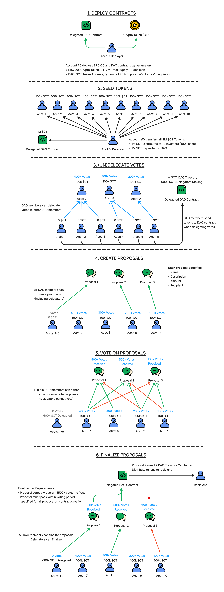

# Crypto Token (CT) DAO with Delegated Voting
This project demonstrates a secure, full stack Decentralized Autonomous Organization governed by an ERC-20 token. The DAO contract manages proposal creation, delegation, voting, and distribution of funds held by the DAO treasury. The DAO leverages the Ethereum blockchain to ensure transparency and democratised control over funds distribution.

## Features
- Creation and voting on proposals by token holders
- Delegation of votes to other DAO members
- Ability to finalize passed proposals and distribute funds
- Front-end application for user-friendly DAO interactions
- Comprehensive testing and deployment scripts

## Stack
Technologies Used:
* JavaScript
* React
* Solidity

Libraries Used:
* [React-Redux](https://react-redux.js.org/)
* [Redux Thunk](https://github.com/reduxjs/redux-thunk)
* [Reselect](https://github.com/reduxjs/reselect)
* [React-Blockies](https://github.com/ethereum/blockies)
* [React-Bootstrap](https://react-bootstrap.github.io/)
* [React-Router-Dom](https://reactrouter.com/web/guides/quick-start)
* [Bootstrap](https://getbootstrap.com/)

Testing Libraries:
* [Jest](https://jestjs.io/)
* [@testing-library/react](https://testing-library.com/docs/react-testing-library/intro/)
* [@testing-library/jest-dom](https://testing-library.com/docs/ecosystem-jest-dom/)
* [@testing-library/user-event](https://testing-library.com/docs/ecosystem-user-event/)

Smart Contract Libraries:
* [@openzeppelin/contracts](https://docs.openzeppelin.com/contracts/4.x/erc20)

Smart Contract and Testing Environment:
* [Hardhat](https://hardhat.org/)

## Local Testing
To test the Crowdsale locally, run the following:
```shell
npx hardhat node

npx hardhat --network localhost scripts/1_deploy.js

npx hardhat --network localhost scripts/2_seed.js

npm run start
```

## Proposal Life Cycle
1. Deploy Token and DelegatedDAO contracts
2. Seed Investors and DAO with Tokens
3. (Un)Delegate Votes
4. Create Proposals
5. Vote on Proposals
6. Finalize Proposals:
- If quorum reached, proposal is finalized as Passed and funds are distributed
- If proposal expired, it is finalized as failed and no funds are distributed

## Delegated DAO Overview

